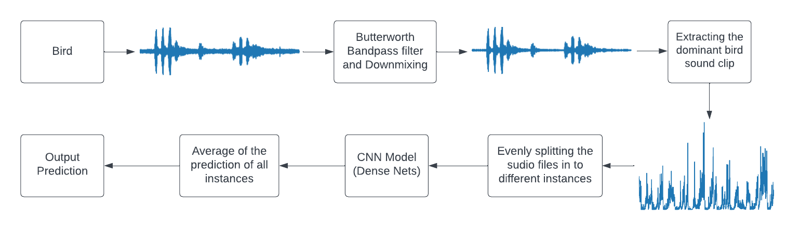

<h1 align="center">Bird Call Classification</h1>

<h4 align='center'> This project identifies and classify the birds in a mixed cacophony by using a model trained on various audio recordings of individual bird voices using neural networks (CNN's) and various pre-processing techniques is used to reduce noise from the audio files.
</h4>

## File Structure

```
.
├── dataset                             -> Contains Dataset of the birds 
|   ├── crow 
|   ├── cuckoo
|   ├── sparrow
|   ├── test
|   ├── train.csv
|   ├── valid.csv
├── Images
|   ├── Architecture.png                
|   ├── Block Diagram.png
├── BE_Proj.ipynb                       -> Code file
```

## Block Diagram



## Modules Implemented


- Data Collection and Preprocessing: The bird audio dataset is collected from Xeno Canto using its open API for 3 birds namely Sparrow, Crow, and Cuckoo. The collected audio files undergo preprocessing steps to clean and prepare the audio files for analysis, which include:

  -a. Noise Removal: A Butterworth filter is used as a band-pass filter to remove or attenuate specific frequencies from the audio signals while preserving the frequencies of interest (bird vocalizations).

  -b. Dominant Audio Clip Identification: The audio files are analyzed to identify the dominant bird audio clips within each file using techniques such as Short-time Fourier transform (STFT), Calculation of Spectral centroid and Bandwidth, Calculation of Mean Spectral Centroid and Bandwidth, Signal-to-Noise Ratio (SNR) Calculation, Time-Varying Power Spectral Density (PSD) Calculation, Power Spectral Density Ratio (PSDR) Calculation, and Extraction of Dominant Bird Sound Clip.

-CNN Model Architecture: The CNN model architecture is designed to classify the bird sound clips into three categories.

-Model Training: The CNN model is trained using the preprocessed bird sound clips.

-Model Evaluation: The CNN model's performance is evaluated on the test set, and the results are reported.


#
